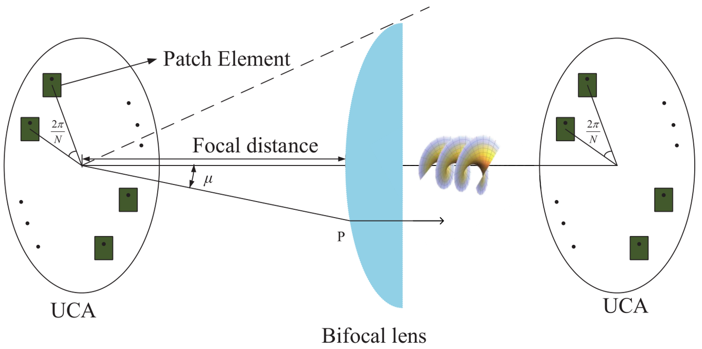
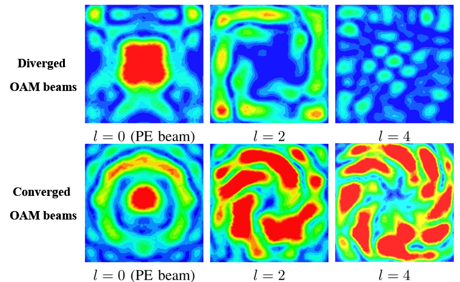

# Orbital Angular Momentum for Wireless Communications

# High-efficient beam-converging for UCA based radio vortex wireless communications
## Our propsed OAM beam converging model.

## Effect of the OMA beam convergence.

